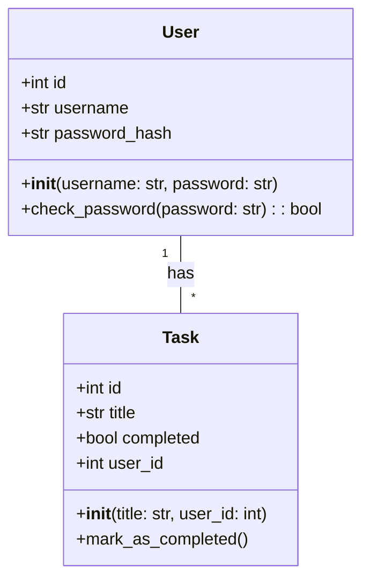
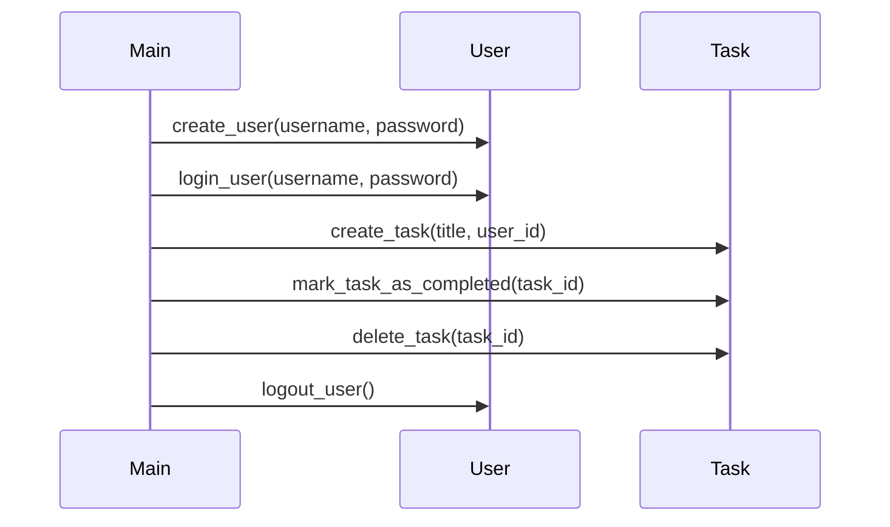

## Implementation approach
We will use Flask, a lightweight and popular Python web framework, for building the web application. For the database, we will use SQLAlchemy ORM with SQLite for simplicity and ease of setup. We will use Flask-Login for handling user authentication and Flask-WTF for forms. The front-end will be built using Bootstrap for responsive design. 

The difficult points of the requirements are user authentication and task management. For user authentication, we will use Flask-Login which provides user session management for Flask. It handles the common tasks of logging in, logging out, and remembering users' sessions over extended periods. For task management, we will use SQLAlchemy ORM to interact with the database. It will allow us to create, retrieve, update and delete tasks in an efficient and Pythonic way.

## Python package name
```python
"todo_manager"
```

## File list
```python
[
    "main.py",
    "models.py",
    "forms.py",
    "templates/index.html",
    "templates/login.html",
    "templates/register.html",
    "templates/base.html",
    "static/css/main.css"
]
```

## Data structures and interface definitions


## Program call flow


## Anything UNCLEAR
The requirement is clear to me.